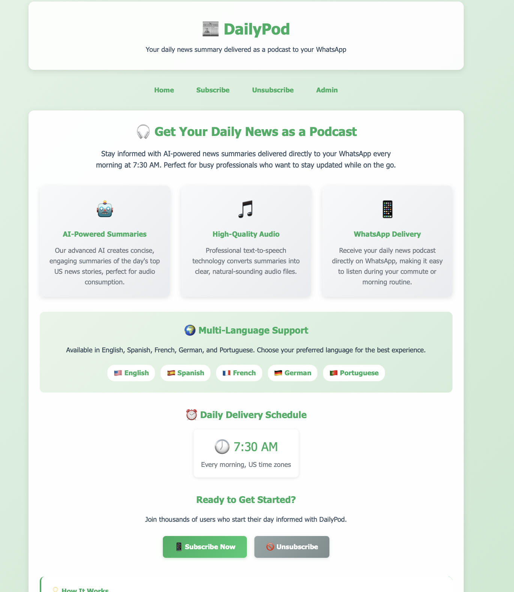
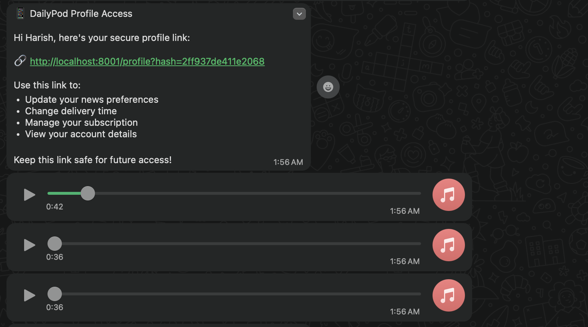

# DailyPod - AI-Powered News Podcast

**Created by Harish Balaji**

DailyPod is an innovative news delivery system that automatically fetches US news, summarizes it using AI, converts it to audio, and delivers it to users via WhatsApp every morning at 7:30 AM. Perfect for busy professionals who want to stay informed while on the go.



## Features

- **AI-Powered Summaries**: Uses ChatGPT to create engaging, concise news summaries
- **Multi-Language Support**: Available in English, Spanish, French, German, and Portuguese
- **High-Quality Audio**: Google Cloud Text-to-Speech for natural-sounding audio
- **WhatsApp Integration**: Direct delivery to users' WhatsApp accounts
- **Automated Scheduling**: Daily delivery at 7:30 AM with automated news fetching
- **Scalable Architecture**: Designed to support 500+ concurrent users
- **Admin Dashboard**: Complete management interface for monitoring and control
- **Database Storage**: SQLite database for user management and article storage

## Quick Start

### Prerequisites

- Python 3.8 or higher
- Redis server (for background tasks)
- Valid API keys for:
  - NewsAPI
  - OpenAI (ChatGPT)
  - WhatsApp Business API
  - Google Cloud (Text-to-Speech)

### Installation

1. **Clone the repository**
   ```bash
   git clone https://github.com/harishbalajib/DailyPod.git
   cd DailyPod
   ```

2. **Install dependencies**
   ```bash
   pip install -r requirements.txt
   ```

3. **Set up environment variables**
   Create a `.env` file in the project root with your API keys:
   ```env
   # Admin Credentials
   ADMIN_USERNAME=admin
   ADMIN_PASSWORD=admin123

   # API Keys
   OPENAI_API_KEY=your_openai_api_key
   WHATSAPP_TOKEN=your_whatsapp_token
   WHATSAPP_PHONE_ID=your_whatsapp_phone_id
   NEWS_API_KEY=your_news_api_key
   GOOGLE_CLOUD_CREDENTIALS=path/to/your/google_credentials.json

   # App Configuration
   DEBUG=True
   HOST=0.0.0.0
   PORT=8001
   REDIS_URL=redis://localhost:6379/0
   DATABASE_URL=sqlite:///./dailypod.db
   ```

4. **Start Redis server**
   ```bash
   redis-server
   ```

5. **Run the application**
   ```bash
   python app.py
   ```

6. **Access the application**
   - Main site: http://localhost:8001
   - Admin panel: http://localhost:8001/admin/login

## How It Works

### For Users
1. **Subscribe**: Visit the website and enter your phone number and preferred language
2. **Receive Welcome**: Get a welcome message on WhatsApp confirming your subscription
3. **Daily Delivery**: Every morning at 7:30 AM, receive your personalized news summary as an audio file
4. **Stay Informed**: Listen to the latest US news while commuting, exercising, or during your morning routine

### System Architecture
1. **News Fetching**: Automated collection of US news from NewsAPI every 6 hours
2. **AI Summarization**: ChatGPT processes articles to create engaging summaries
3. **Audio Generation**: Google Cloud TTS converts summaries to high-quality audio
4. **WhatsApp Delivery**: Automated sending to all active subscribers
5. **Monitoring**: Comprehensive logging and admin dashboard for system management



## API Integration

### NewsAPI
- Fetches top US headlines across multiple categories
- Supports multiple languages
- Automatic deduplication of articles

### OpenAI (ChatGPT)
- Creates concise, engaging summaries
- Multi-language support
- Optimized for audio consumption

### Google Cloud Text-to-Speech
- High-quality neural voices
- Multiple language support
- Optimized audio settings for clarity

### WhatsApp Business API
- Direct message delivery
- Audio file sharing
- Delivery status tracking

## Admin Features

### Dashboard
- Real-time system statistics
- User activity monitoring
- System health checks
- Recent activity logs

### User Management
- View all subscribers
- Toggle user status
- Monitor delivery history
- Language preferences

### Article Management
- Browse all fetched articles
- View AI-generated summaries
- Monitor audio generation status
- Filter by language and category

### Manual Controls
- Trigger news fetching
- Manual delivery testing
- System health monitoring
- Audio cleanup management

## Configuration

### Supported Languages
- English (en)
- Spanish (es)
- French (fr)
- German (de)
- Portuguese (pt)

### News Categories
- General
- Business
- Technology
- Sports
- Entertainment

### Delivery Schedule
- **Daily Delivery**: 7:30 AM (US time zones)
- **News Fetching**: Every 6 hours
- **Audio Cleanup**: Daily at 2:00 AM
- **Health Checks**: Every hour

## Scalability

The system is designed to handle 500+ concurrent users with:
- Efficient database queries
- Background task processing
- Automated resource cleanup
- Comprehensive error handling
- System monitoring and logging

## Security

- Admin authentication required for management functions
- API key protection
- Input validation and sanitization
- Secure file handling
- Error logging without sensitive data exposure

## Docker Deployment

For production deployment using Docker:

1. **Start Redis and Celery**
   ```bash
   docker-compose up -d redis
   celery -A tasks worker --loglevel=info
   ```

2. **Run the application**
   ```bash
   python run_docker.py
   ```

## Troubleshooting

### Common Issues

1. **Redis Connection Error**
   - Ensure Redis server is running
   - Check REDIS_URL configuration

2. **API Key Errors**
   - Verify all API keys are valid and active
   - Check API quotas and limits

3. **WhatsApp Delivery Issues**
   - Verify WhatsApp Business API setup
   - Check phone number format (should include country code)

4. **Audio Generation Problems**
   - Ensure Google Cloud credentials are valid
   - Check available disk space for audio files

### Logs
System logs are stored in the database and accessible through the admin dashboard. Check for:
- API request failures
- Delivery errors
- System warnings
- Performance metrics

## Development

### Project Structure
```
DailyPod/
├── app.py                 # Main Flask application
├── config.py             # Configuration settings
├── models.py             # Database models
├── tasks.py              # Celery background tasks
├── services/             # Service modules
│   ├── news_service.py   # News API integration
│   ├── ai_service.py     # OpenAI integration
│   ├── tts_service.py    # Text-to-Speech service
│   └── whatsapp_service.py # WhatsApp integration
├── templates/            # HTML templates
├── static/               # Static files
├── test/                 # Test scripts
└── requirements.txt      # Python dependencies
```

### Running Tests
```bash
python test/test_system.py
```

## License

This project is created by Harish Balaji. All rights reserved.

## Support

For support or questions, please contact the development team or create an issue in the project repository.

---

**DailyPod** - Your AI-powered daily news podcast, delivering the world's stories to your WhatsApp every morning. 
